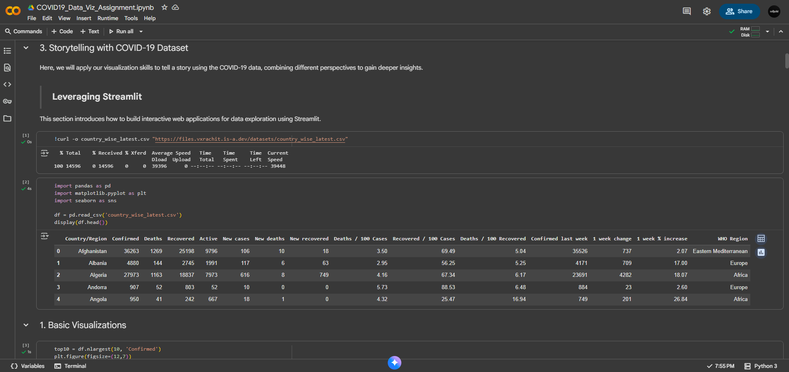
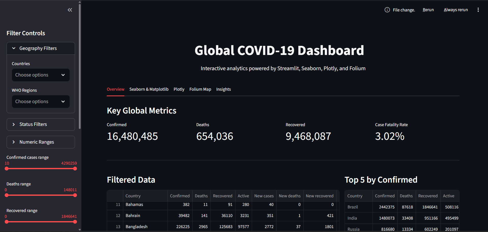
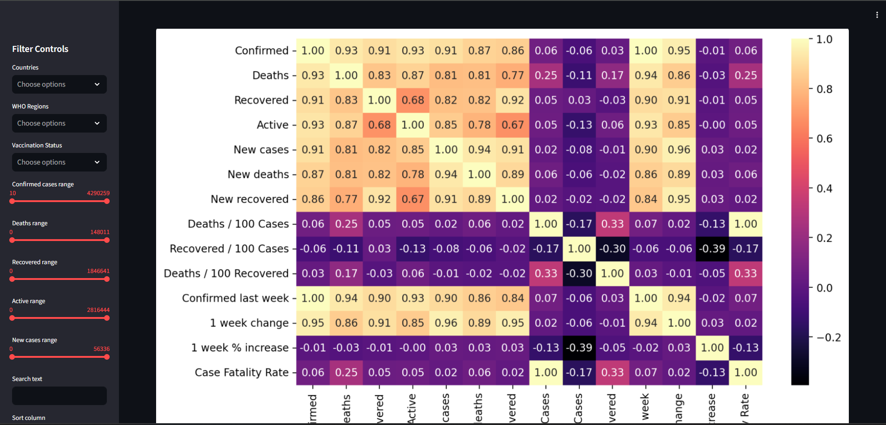
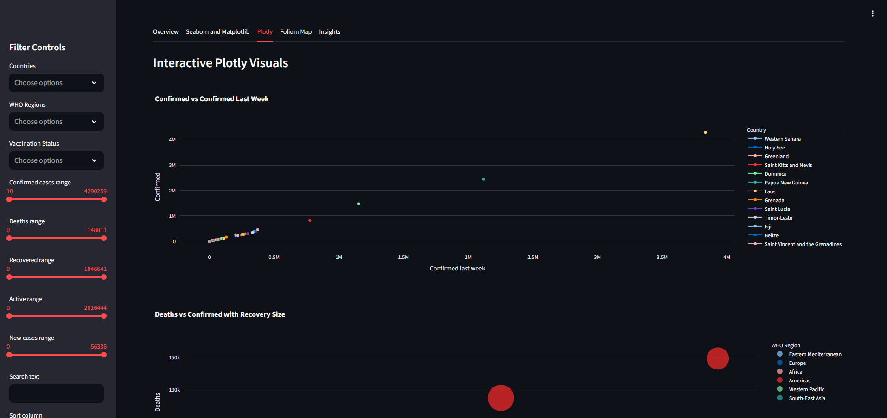
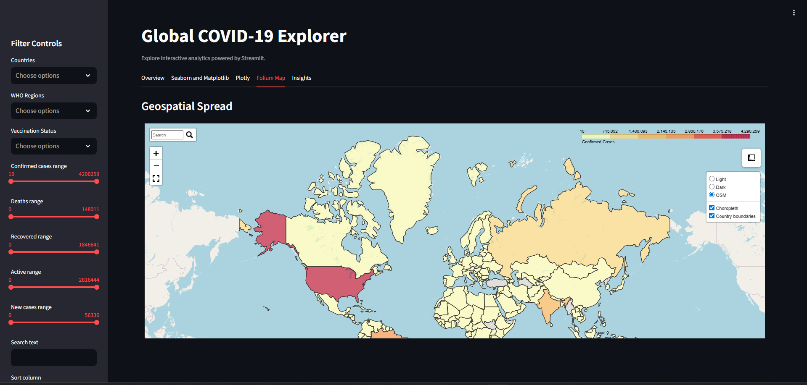
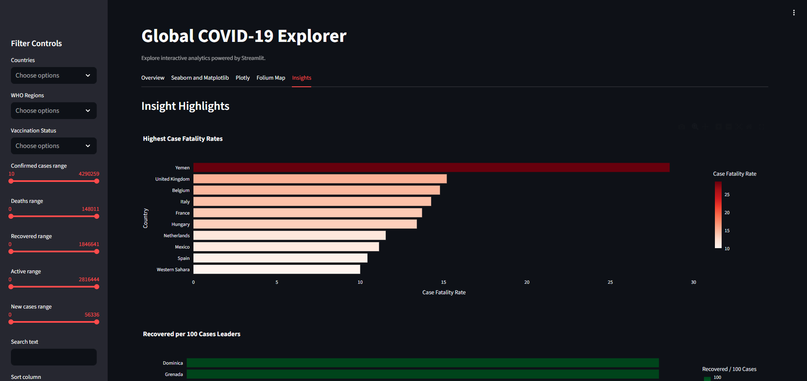

# vxrachit — COVID-19 Data Visualization Dashboard

Explore global COVID-19 data interactively with vxrachit, a dashboard built using Streamlit, Seaborn, Matplotlib, Plotly, and Folium. Analyze country-level metrics, visualize trends, and interact with maps and charts.

## Contents

- `app.py`: Main Streamlit application. Loads `country_wise_latest.csv`, provides filtering, visualizations, and a Folium map.
- `country_wise_latest.csv`: Dataset containing COVID-19 statistics by country.
- `COVID19_Data_Viz_Assignment_01.ipynb`: Jupyter notebook for data exploration and app generation. Includes Colab setup for running Streamlit via cloudflared.
- `assets/`: Images and resources for documentation and analysis.
- `collab_preview.pdf`: Preview of the notebook in PDF format.

## Useful Links

- Try in Colab: https://colab.research.google.com/drive/1aPnOTwyBHD8o00i0fJ2WGQl64wj67Kis?usp=sharing


## Visual Previews

- **Colab Setup**  
  
- **DashBoard Overview**  
  
- **Matplotlib & Seaborn**  
  
- **Plotly**  
  
- **Folium Map**  
  
- **Insights**  
  


## Features

- Summary metrics: Confirmed, Deaths, Recovered, Case Fatality Rate.
- Multiple tabs for visualization:
  - Overview: KPIs and sortable/filterable data table.
  - Seaborn & Matplotlib: Bar charts, heatmaps, box plots.
  - Plotly: Interactive charts (line, scatter, treemap, funnel).
  - Folium Map: World choropleth with search, popups, basemaps, minimap, fullscreen, and measurement tools.
  - Insights: Highlights such as top fatality rates, recovery leaders, and fastest growth.

## How to Use

- The dashboard auto-loads `country_wise_latest.csv` (no upload needed).
- Use the sidebar to filter by country, region, vaccination status, and numeric ranges (Confirmed, Deaths, Recovered, Active, New cases). Date filtering is available if supported by the data.
- Download filtered results as CSV.

### Local Setup

1. Set up Python and install required packages:

   ```powershell
   pip install streamlit pandas numpy seaborn matplotlib plotly folium pycountry
   ```

2. Launch the app:

   ```powershell
   streamlit run app.py
   ```

3. Open the provided URL in your browser.

### Run in Colab (Streamlit + cloudflared)

- Use the Colab link above. The notebook includes steps for installing dependencies, writing `app.py`, and starting Streamlit with a public tunnel.

## Tips & Troubleshooting

- The map requires internet access for GeoJSON data. If blocked, a message will appear and errors are logged.
- Country name mismatches are resolved using an internal ISO3 mapping. Unmatched countries are excluded from the map but shown in tables.
- If your CSV uses different column names, the app attempts to standardize them (e.g., `Country/Region` to `Country`). Manual edits may be needed for unusual formats.

## Credits

Built with:

- Streamlit (UI)
- Pandas, NumPy (data processing)
- Seaborn, Matplotlib (static charts)
- Plotly (interactive charts)
- Folium (maps)

All images in `assets/` were generated during analysis and visualization of the project.
